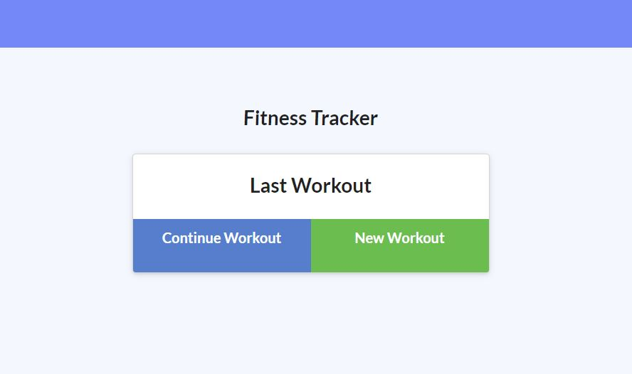
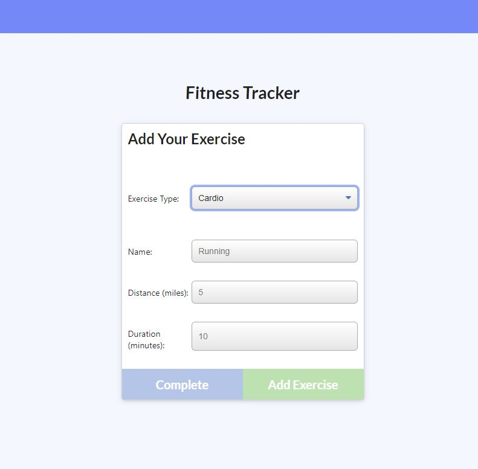
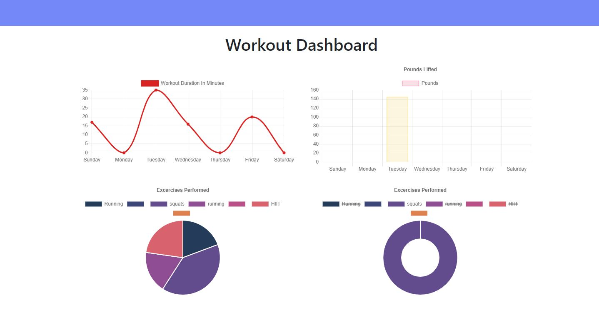

# Fitness Tracker

### Deployed Application 

### Description 
This application allows users to enter in workouts to track their activity. 

When using this application, users will be able to add  new workouts, either resistance or cardio workouts. Then the user can enter in specifics like duration, weight, distance, etc. When a workout is finished, users can go to the dashboard to see their progress.

### Features
* MongoDB 
* JavaScript    
* Utilizes NoSQL to query and route 

### Credit
Alejandra Reyes
* areye022@gmail.com
* [GitHub](https://github.com/areye022)
* [LinkedIn](https://www.linkedin.com/in/alejandrareyes022/)

### License
Licensed under [MIT License](./LICENSE)